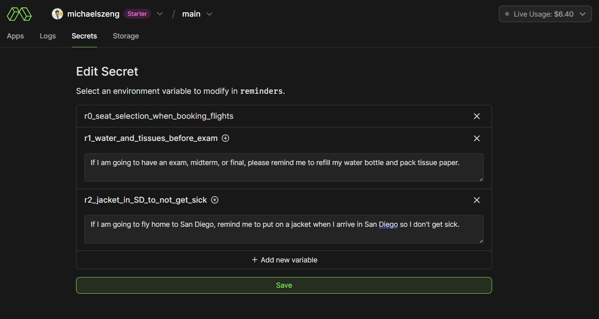

# LifeAssistant


Do you always forget stupid things? Filling your water bottle before a 3-hour exam? Packing your earbuds when you travel? Then LifeAssistant is for you! LifeAssistant is a LLM Integration with your Google Calendar and Todoist task-list to send you relevant reminders for your events and tasks. You can customize/slowly accrue the list of things you want LifeAssistant to remind you about.


### How it Works:

LifeAssistant exists as a serverless cloud function, utilizing the Google Calendar API and and Todoist API to invoke the cloud function as a HTTP webhook upon the creation or modification of calendar or to-do list tasks and events. Whenever LifeAssistant is invoked, it prompts the large language model Llama to determine whether the invoking task or event warrants sending a reminder to the user, in which case, it will generate a reminider and schedule a push-notification to the user's mobile device ahead of the task or event. The user, meanwhile, can continually add or remove items from a list of natural-language "requests" about things they want to be reminded about.

For the end-user, this means that you only need to deploy this app once, keep building that list of things you need reminders for, and otherwise sit back and let LifeAssistant do its work.

### Technologies used:
- **[Modal](https://modal.com/)** for severless hosting of a function with GPU access for LLM inference
- **Google Cloud Firestore** for NoSQL database storage of persistent data for the Modal function
- **[Llama 3.1](https://llama.meta.com/)** running "locally" for natural language analysis of tasks and calendar events and generation of reminders
- **Google Cloud Tasks** for scheduled notifications
- **Google Calendar API** to read calendar events and changes
- **[Todoist API](https://todoist.com/)** to read tasks and changes
- **[Pushover](https://pushover.net/)** to send push notifications to a mobile device

Note: LifeAssistant requires Pushover, which charges a one-time $5 fee beyond the 30-day trial.


## Installation and Setup

Estimated time: 20 min.

### Modal Installation and Setup
1. Create account on [Modal](https://modal.com/login)
2. Install dependencies: `pip install -r requirements.txt`
3. Run `modal setup` to authenticate (if this doesn’t work, try `python -m modal setup`)


### Google Cloud Platform (GCP) Credentials, Firestore, and Tasks Setup
1. [Sign into GCP](https://console.cloud.google.com/) using you desired Google Account
2. Select "Select a Project" and click "New Project". Give your project a name (i.e. LifeAssistant) and press "Create".
3. [Create an App Engine application](https://console.cloud.google.com/appengine). Select a region for your application, and select "App Engine default service account" under **Identity and API access**. We technically do not need an App Engine application, but we create one here since it also generates a fully-permissioned service account we can use for authentication for the other APIs we need.
4. [View your service accounts](https://console.cloud.google.com/iam-admin/serviceaccounts). Click the 3 dots next to the "App Engine default service account", and click "Manage keys". Also, make sure you save the email associated with the "App Engine default service account"; we will use this later in the **Setting Calendar Permissions** step.
5. Under "ADD KEY", Select "Create new key". Create a new JSON key. This should download a JSON file to your computer.
6. Rename this JSON file to "service_account.json" and move it into a directory called `data_files/`.

#### Firestore
1. From the Hamburger Menu, go to "APIs & Services" --> "Enabled APIs & Services".
2. Click "+ ENABLE APIS AND SERVICES". Search for *Google Cloud Firestore API* and enable it.
2. In the [Firestore dashboard](https://console.cloud.google.com/firestore/databases), press "CREATE DATABASE" and create a new default database (you do not need to change any configurations, just press "CREATE" ).
3. In the Firestore dashboard, within the "(default)" database, press "+ START COLLECTION" to add a Collection and name it "LifeAssistant".

LifeAssistant will now be able to store persistant data (such as Calendar sync tokens, a queue of scheduled notifications, etc.) in documents in Google Firestore!

#### Tasks
1. Using the same procedure as above, enable the *Cloud Tasks API*. Create a billing account if needed.
2. In the [Tasks dashboard](https://console.cloud.google.com/cloudtasks), press "+ CREATE QUEUE". Name your queue "text-messages", select "us-central1 (Iowa)" as your region (this region is hardcoded so you can't use a different region without modifying the code). Press "CREATE".

LifeAssistant will now be able to schedule tasks for itself (i.e. scheduled reminders for you in the future)!

#### Calendar
1. Using the same procedure as above, enable the *Google Calendar API*. That is all!


### Setting Calendar Permissions
1. Go to the settings menu in your [Google Calendar](https://calendar.google.com/calendar) (gear icon top right corner)
2. Click Settings for my calendar.
3. Select the calendar you want to share.
4. In Calendar settings, under Share with specific people or groups, click + Add people and groups
5. Add your service account email with the permissions "See all event details" at a minimum
6. Click Send.


### Todoist App Setup
1. Log into Todoist and create a new app in your [Todoist Developer Console](https://developer.todoist.com/appconsole.html)
2. Set "OAuth redirect URL" to `https://todoist.com/oauth/authorize`
3. Set "Webhook callback URL" to your Modal Function URL
4. Add the following item(s) to "Watched Events":
 - `item:added`
5. Click "Activate webhook"
6. Perform Todoist webhook Authorization procedure (See ["Webhook Activation & Personal Use"](https://developer.todoist.com/sync/v8/#webhooks))

    a. Enter the following string into your browser, replacing the `client_id` with the actual Client ID of your Todoist app (found in your Todoist Developer Console): `https://todoist.com/oauth/authorize?client_id=0123456789abcdef&scope=data:read,data:delete&state=secretstring`

    b. Press "Agree".

    c. This should redirect you to a url containing a `code`. Copy this code.

    d. In a command line, run this command, replacing the `client_id` and `client_secret` with their respective values from your Todoist Developer Console and replacing `code` with the code you got in step *6. c.*:
    ```bash
    $ curl "https://todoist.com/oauth/access_token" \
    -d "client_id=0123456789abcdef" \
    -d "client_secret=secret" \
    -d "code=abcdef" \
    -d "redirect_uri=https://www.google.com/"
    ```

Your Todoist should now be authorized to send webhooks to your Modal function whenever you add or modify a task!


### Pushover Setup
To send life reminders, Pushover is used. Pushover accepts simple HTTP Requests and sends push notifications to a device using the Pushover app.
1. Download the Pushover mobile app (works on IOS or Android).
2. In the Pushover App, create an account and take note of your User Key.
3. Create a Pushover Application from the Pushover [web dashboard](https://pushover.net/apps/build). Take note of the resulting API Token/Key.


### HuggingFace and LLama Setup
LifeAssistant utilizes Meta AI's pre-trained Meta-Llama-3-8B-Instruct model to analyze your tasks and calendar events and determine whether they are worthy of sending a reminder for. LifeAssistant also uses HuggingFace to download the model weights and run inferences. Therefore, you need to set up an account with HuggingFace and request access to the Llama 3 8B Instruct model (it is not publicly accessible without requesting access).
1. [Create a HuggingFace account.](https://huggingface.co/join)
2. [Generate a HuggingFace token.](https://huggingface.co/settings/tokens) Save this token.
3. [Rquest Access to Meta-Llama-3-8B-Instruct.](https://huggingface.co/meta-llama/Meta-Llama-3-8B-Instruct) This may take some time to get approved.


### Data File Setup
- Create a file `data_files/data.py`
- Enter this data into `data.py`:
```python
google_cloud_project_id = 'Your Google Cloud Project ID (i.e. `lifeassistant-123456`)'
calendar_id = 'Your Calendar ID (i.e. 'primary', or 'your_email@gmail.com')'
modal_function_address = 'Your Modal Function URL' (i.e. https://[your-Modal-account-username]--webhook-v3.modal.run)
todoist_api_token = 'Your Todoist account API token (see https://todoist.com/help/articles/find-your-api-token)'
todoist_projects = ['0123456789', '9876543210']  # List of project ID's whose tasks you want LifeAssistant to be able to see. You can find your project's ID by opening your Todoist project in the web-version of Todoist and extracting it from the URL.
pushover_api_token = "Your Pushover Application API Token/Key"
pushover_user_key = "Your Pushover Account User Key"
huggingface_token = "Your HuggingFace token"
```

You can find your calendar ID by going to your Google Calendar, clicking on the three dots next to your calendar in the bottom left, --> "Settings and Sharing" --> "Calendar ID".


### Reminders
Use natural language to tell LifeAssistant what to remind you about. Reminders are compiled in the Modal web dashboard for ease of access. To add reminders, go to [your Modal Dashboard](https://modal.com/secrets/), press "Create new secret", select "Custom" for the type of secret, add a new key-value pair for each reminder. Every key should be of the format "rX_...", where "X" is a unique number (i.e. 0, 1, 2, etc.) and "..." can be any string (containing only numbers, letters, and underscores) that helps you remember what the reminder is. Then name your secret "reminders", and press "Create" to finish creating the secret. 



You can modify this secret to add or remove reminders at any time.

A few examples of what I remind myself to do:
```
"If I am going to book a flight, please remind me to try to select a window seat on the left side of the plane. Note that I do not need this reminder if I have already booked the flight and am just taking the flight."
"If I am going to have an exam, midterm, or final, please remind me to refill my water bottle and pack tissue paper."
"If I am going to fly home to San Diego, remind me to put on a jacket when I arrive in San Diego so I don't get sick."
"If I am going to get a blood test, remind me to print out the lab order beforehand."
```


### Deployment
To test your setup, run `modal serve modal_function.py`. This will deploy your app temporarily, until you hit `Ctrl + C` in your terminal to shut the app down. While you app is served, you can create calendar events or Todoist tasks, see debug print messages in your terminal, and see that your LifeAssistant successfully sends you appropriate reminders on your mobile device. Note that the LifeAssistant is hardcoded to send notifications 4 hours ahead of the start time of Google Calendar events. Also note that, while your app is served, the function URL is slightly modified to be `https://[your-Modal-account-username]--webhook-v3-dev.modal.run` instead of `https://[your-Modal-account-username]--webhook-v3.modal.run`; you will have to modify `modal_function_address` in data.py accordingly.

When you are ready to fully deploy your LifeAssistant, run:
```
modal deploy modal_function.py
```

Your LifeAssistant is now live!


## Common Links to Monitor LifeAssistant Status and Credit Usage

Modal gives $30 of free monthly credits. All Google Products should be able to be used free of charge so long as you under the free quota. The Todoist API is free.

- [Modal Dashboard for Cloud Function/Compute/Storage Usage](https://modal.com/apps/)
- [Google Cloud Platform Billing Dashboard](https://console.cloud.google.com/billing)
- [Google Cloud Tasks Queue](https://console.cloud.google.com/cloudtasks)
- [Google Cloud Firestore File Storage](https://console.cloud.google.com/firestore/databases)
- [Todoist Dashboard](https://developer.todoist.com/appconsole.html)


## Credits
- **example-py-gcal-api-cloud-function** by ayvi-0001. Licensed under the [MIT License](https://opensource.org/licenses/MIT).
  - Repository: https://github.com/ayvi-0001/example-py-gcal-api-cloud-function
- **aw-import-ical**. Repository: https://github.com/ActivityWatch/aw-import-ical/
